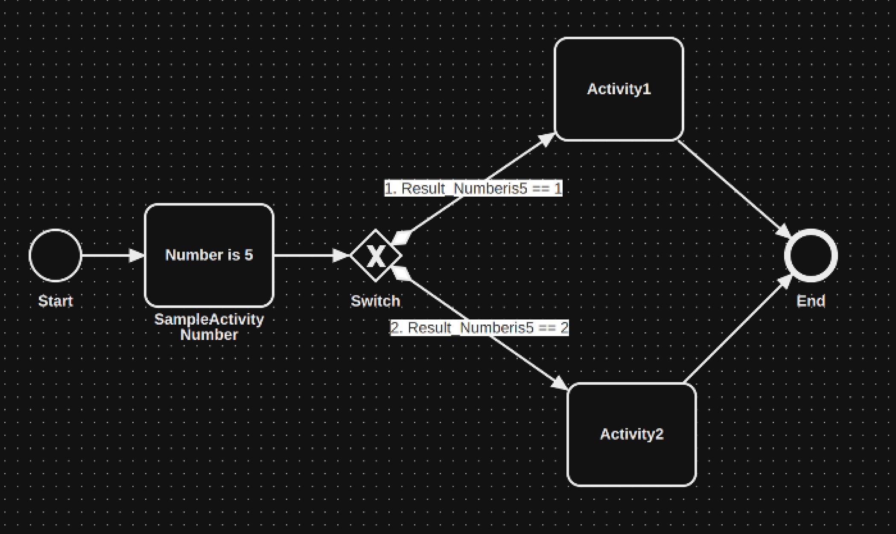

# Switch Recovery

When none of the condition defined in switch state is fulfilled, workflow will throw an exception to allow manual 
recovery by user.

Below example workflow will create switch recovery events because it is trying to evaluate the conditions whether 5 is 
equal to 1 or 2.


### RecoverTaskScheduled

When this event is created, it generates `attributes.input` field with list of nearest activities that workflow can 
recovery from
```json
{
    "event_type": "RecoverTaskScheduled",
    "task_name": "Switch",
    "task_type": "Recover",
    "attributes": {
        "input": [["activity1", "activity2"], "Switch"]
    }
}
```
First object inside the `input` field is the list of activities. (as per above example: ["activity1", "activity2"])

### RecoverTaskStarted

When this event is created, it generates `attributes` field with

```json
{
    "event_type": "RecoverTaskScheduled",
    "task_name": "Switch",
    "task_type": "Recover",
    "attributes": {
        "workflow_id": "0ee7f976-d85d-4856-8e5c-b5b635baca7a_29", 
        "workflow_run_id": "f6704d77-ad60-47ee-a328-48f7748d41c7"
    }
}
```

:::caution
Do not confuse `workflow_id` created by form activity with `workflow_id` from
[Start Workflow API](../../Workflow%20API/8-start-workflow-execution.api.mdx). Former is the child `workflow_id` and
latter is the parent `workflow_id`. When you interact with switch recovery, you should use the child `workflow_id`.
:::

Workflow waits for the user input by creating listener with `acivity_name` value. To recover the workflow call the 
[Signal Workflow API](../../Workflow%20API/12-signal-workflow-activity.api.mdx) with `workflow_id`, `activity_name` and 
request body. Request body data field must have the name of the activity to recover.

For example, to recover `activity1`

```javascript
const axios = require('axios');
let data = JSON.stringify({
    "data": "activity1"
});

let config = {
    method: 'post',
    maxBodyLength: Infinity,
    url: 'http://wfm.dev.ar2/v1/signal/workflow/:workflowid/signalname/:signalname',
    headers: {
        'Content-Type': 'application/json',
        'Accept': 'application/json'
    },
    data : data
};

axios(config)
    .then((response) => {
        console.log(JSON.stringify(response.data));
    })
    .catch((error) => {
        console.log(error);
    });
```

### FormTaskCompleted

When the workflow is finally recovered, this event will be created with recovered activity name inside the 
`attributes.result` field.
```json
{
    "event_type": "RecoverTaskScheduled",
    "task_name": "example",
    "task_type": "Recover",
    "attributes": {
        "result": ["Activity1"]
    }
}
```