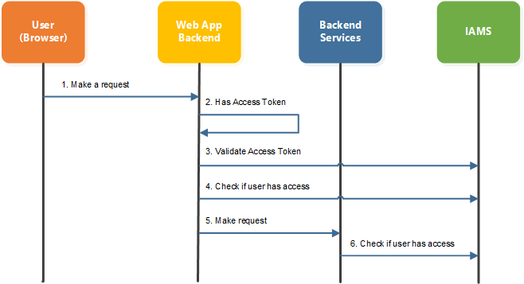

#	Fine-grained Access Control
In fine-grained access control, resource and scope are used to grant access to the application.

Resource are created to represents protected entity or object within the Application, and scope are the action allowed to be performed on the protected resource.

Permission to perform specific scoped action on a protected resource is then granted to user, via role assigned to user, via group associated with user, or direct granting the permission to user.

IAMS provides the necessary APIs to evaluate whether user has been granted specified permission (specific scoped action on specific resources) and also all the scoped actions that user is permitted on specific resource. The latter is useful in UI rendering to determine whether certain buttons need to be show or hide based on the scoped actions permitted to the user.

For fine-grained access control, IAMS supports:

*	**User-based Access Control (UBAC)** – user is directly granted specific permission (specific scoped action on specific resources).

*	**Role-based Access Control (RBAC)** – the permission is granted to the role(s) such that users assigned with those roles will be allowed to perform the scoped action on the resource. 
By default, roles granted with the permission are not specified as required meaning access will be granted if the user requesting access has been granted any of the roles.
However, you can specify a specific role as required when granting permission to roles, such that user must have the required role in order to be granted access.   

*	**Group-based Access Control (GBAC)** – the permission is granted to the group(s) such that users belonging to any of the group will be permitted to perform the scoped action on the resource. 
By default, access restriction is only applied to the groups granted with permission. However, it is possible to enable `Extend to Children` during the granting of the permission such that the users belonging to the subgroup of the granted group will also inherit the permission.
  
Typical flow for fine-grained authorization is as follows:

1.	User make a request to Web App Backend.

2.	Web App Backend check whether user has `Access Token` in cookies. If `Access Token` is not present, user will be denied access and redirect to Keycloak for authentication. 

3.	If `Access Token` is present, Web App Backend will then need to validate the `Access Token` to ensure it is valid. To check for validity of the `Access Token`, Web App Backend can use the [Online](../06_authentication/02_ID_token_access_token_refresh_tokens.md#online-validation) or [Offline](../06_authentication/02_ID_token_access_token_refresh_tokens.md#offline-validation) Validation. 

4.	Once determine that the `access token` is valid, Web App Backend will then make a request to IAMS to evaluate whether user is granted permission to perform specific scoped action on specific resource. If the evaluation request result is `Unauthorized`, application will redirect user to error page.

:::note
   As part of the permission evaluation processing, IAMS will also perform Access Token validation. Hence, it is possible to skip step 3 since it is also performed by IAMS.
:::

5.	If user has the correct permission, Web App Backend can then direct the request to the Backend Services.

6.	Backend Services when received the request can also invoke IAMS again to evaluate whether user has the right permission. 

