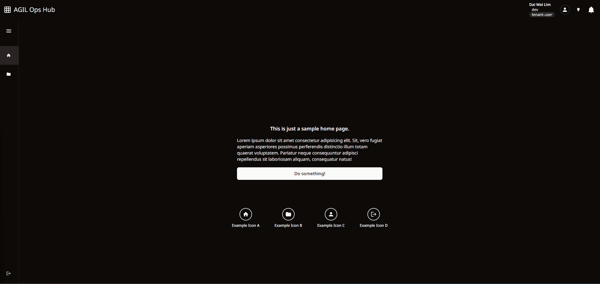
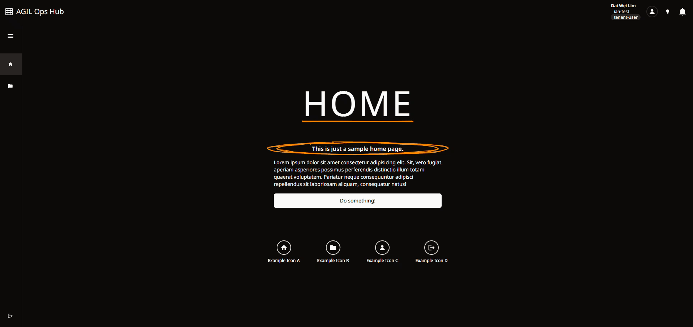
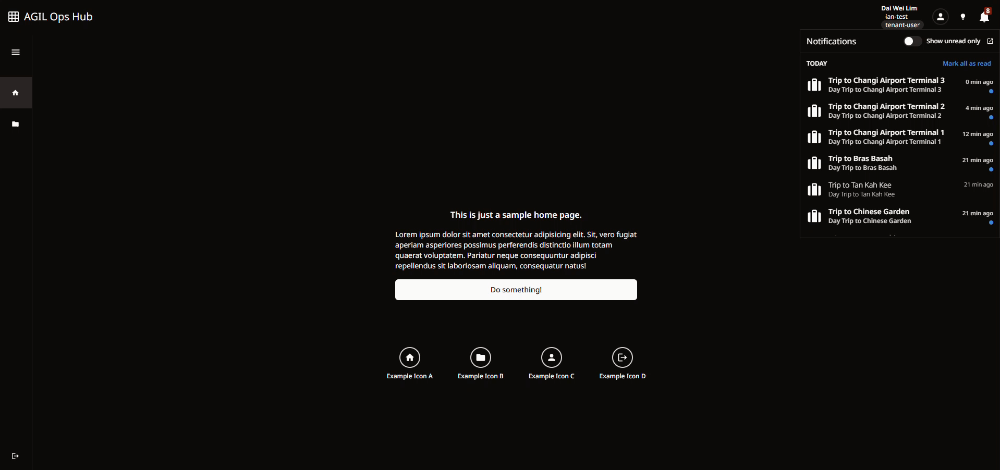

# Introduction
<!-- RTUS to be linked when the page is created -->
The In-App Notifications (IAN) module provides **three** frontend components: `toast`, `notification badge`, and `dropdown menu`, as well as the backend API. It seamlessly integrates with our RTUS (Real-Time Update System) and [UNH (Unified Notification Hub)](../80_unh/introduction.md) modules via the IAN backend service.

## Toast Notification

<!-- RTUS to be linked when the page is created -->
The toast notification can be integrated with RTUS, which uses [server-sent events](https://developer.mozilla.org/en-US/docs/Web/API/Server-sent_events) under the hood to perform real-time notification updates. As seen in the gif above, whenever a new notification is pushed via UNH's API call, the toast will be triggered in real-time.

## Notification Badge

As seen in the top right of the page in the gif above, when a new update is pushed via the RTUS, the number of unread messages, in red, will also be updated.

:::info
To clearly show the notification badge changes, the toast notification location is set to bottom-right in the gif. This is a configuration change that is easily done as part of a built-in feature that comes with shadcn-svelte's sonner(toast) component.
:::

## Dropdown Menu

The dropdown menu is expanded by clicking on the notification badge. Upon expansion, a list of notifications will be displayed. Within the dropdown menu itself, there is a toggle switch that allows users to toggle between all notifications and unread notifications, as well as a "mark all as read" button that will mark all notifications on the list as read.

