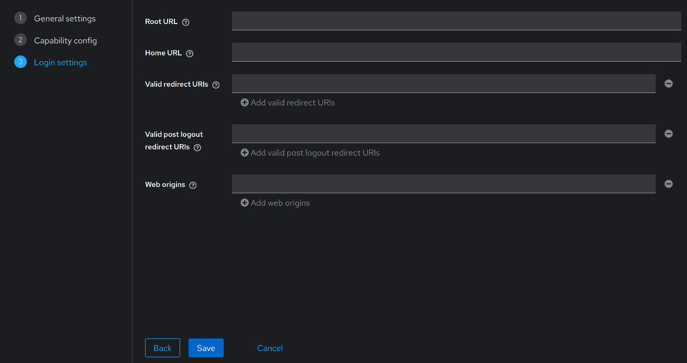
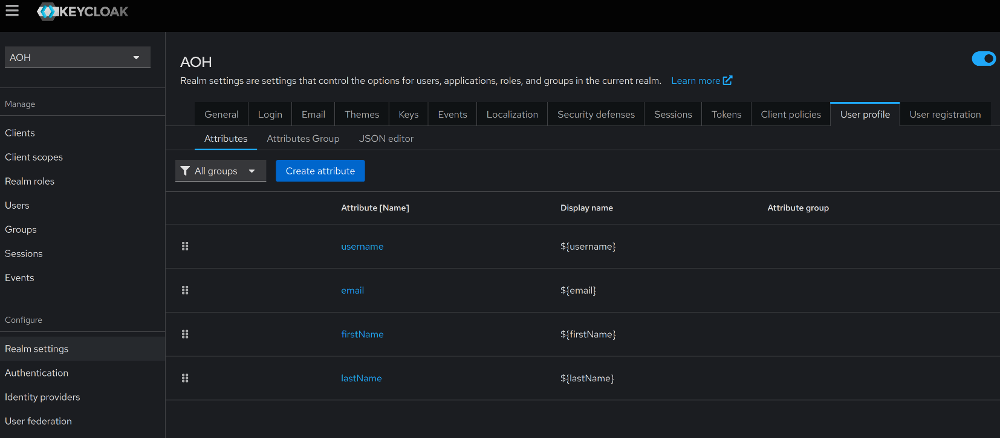
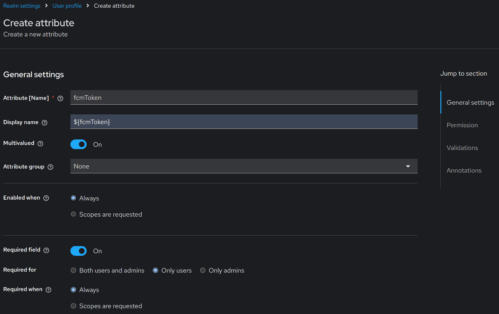
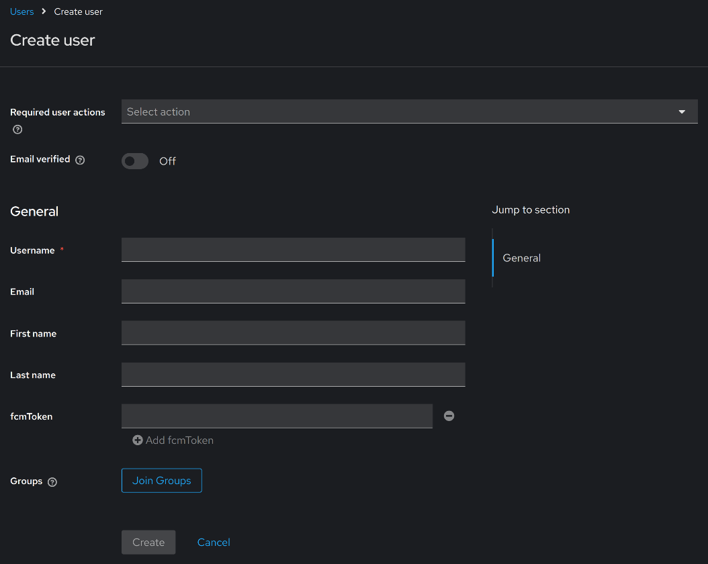

# Prerequisite

- [k3s](https://docs.k3s.io/quick-start)
- [kubectl](https://kubernetes.io/docs/tasks/tools)
- [helm](https://helm.sh/docs/intro/install/)
- [psql](https://www.timescale.com/blog/how-to-install-psql-on-mac-ubuntu-debian-windows)
- AOH-IAMS
  - [IAMS-Keycloak](https://mssfoobar.github.io/docs/docs/modules/iams/quick_start/deploy_iams_keycloak)
  - [IAMS-AAS](https://mssfoobar.github.io/docs/docs/modules/iams/quick_start/deploy_iams_aas)

# PTMGR Dependencies

PTMGR is tightly coupled with AOH-IAMS to store FCM token in IAMS user profile.

Necessary resources needed for PTMGR
- keycloak client for PTMGR to call IAMS-AAS API
- keycloak user with FCM token attributes

:::important
It is essential to have a fully functional IAMS installed before starting with UNH.
To learn more about IAMS, please refer to [IAMS docs](https://mssfoobar.github.io/docs/docs/modules/iams/introduction).
:::
 
## Keycloak client for PTMGR to call IAMS-AAS API

After deploying AOH-IAMS in your Kubernetes cluster, you can access its admin console to create a new client.

1. Login to Keycloak Admin Console and switch the realm. This example demonstrates using AOH realm.

2. Click on `Clients` in the side menu and click on `Create client` button.

3. Go through the steps below to create a new client.
    - Fill up the required fields (you can enter your own value here)

    - Set capabilities settings

    - Leave the fields below empty and click on `Save`.

4. Click on `Service accounts roles` tab and click on `Assign role`.

5. Assign the `sys-admin` role to the client by selecting `Filter by realm roles` at the top left.

6. You have created a new client in AOH-IAMS. Go to the `Credentials` tab in the client details page and take note of 
the client id and client secret which will be needed in PTMGR deployment.

## Keycloak user with FCM token attributes

:::note
Generating an FCM token is outside the scope of UNH. For more information on generating an FCM token from a mobile
device, refer to the [Google FCM guide.](https://firebase.google.com/docs/cloud-messaging/android/client)
:::

By default, Keycloak does not come with the FCM token attribute configured in the user profile. We need to add the FCM token 
attribute to allow PTMGR to store users' mobile FCM tokens in the IAMS user profile.

1. Click on `Realm Settings` in the side menu and click on `User profile` tab. Inside the `User profile` tab, click on 
`Add attribute` button.

2. Follow the settings below to create a FCM token attribute.

3. Once FCM token attribute is created, `fcmToken` will be appeared in the user profile. Click on `Users` in the side 
menu and click on `Add user` to check the FCM token attribute.

